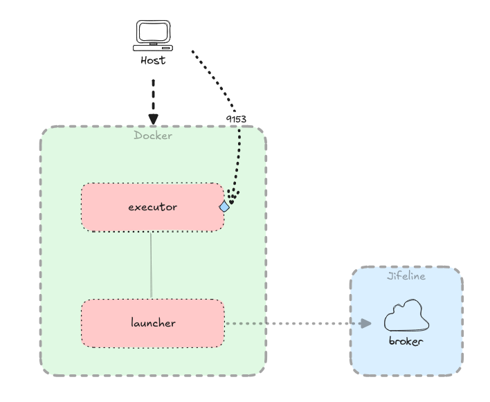

# openOBD examples

With this project we aim to create a simple setup to run and host openOBD functions. While the most simple setup would be to create a
single openOBD function that registers itself to the openOBD network, this project aims to be a more scalable solution. This is also
the solution used by [Jifeline Networks](https://jifeline.net/en/).

This project consists of three parts:

- The [Function Launcher](./launcher/README.md) (_launcher_)
- The [Function Executor](./executor/README.md) (_executor_)
- The infrastructure around the _launcher_ and _executor_ (mostly just _Docker Compose_)

## Configuring your local environment

First, you'll need to configure your Partner API credentials (see the [openOBD documentation](https://docs.openobd.com/latest/quickstart/credentials/)
on how to create these). You can create a copy of the `env.dist` file and fill in the blanks with your credentials. The name
of the new file should correspond to the name configured for `env_file` in the `docker-compose.yml` file (i.e. `env`).

After configuring your credentials, you'll need to configure the openOBD functions that will be registered by the launcher
and hosted by the executor. Change the `functions.json` file (located in the `launcher/resources` folder) with your
own function's uuid and signature (if you haven't registered a function yet, [follow these steps](https://docs.openobd.com/latest/design/function_broker/#generating-function-uuid-and-signature)).

Now that you have set up your credentials and function(s), you can create your local environment. Simply build the images
for both the launcher and executor by executing `docker build --tag openobd-examples/launcher .` and `docker build --tag openobd-examples/executor .`
in their respective directories (note:  if a different image tag is chosen, the `docker-compose.yml` file should be changed).

Finally, you need to supply the function code that will be executed by the executor. This can be as simple as a `Hello World!` script,
as long as it can be run by the executor (which is written in Python 3). Example functions are supplied in this project, in the
`functions/<example_name>` directories.

## Running the local environment

When the local environment is fully prepared you should simply be able to run the `docker-compose.yml` file with Docker
Compose (`docker compose up`). The _launcher_ will register its configured function(s) with the public Function Broker (_broker_, hosted
by Jifeline). When a function would be requested by an openOBD Client, the _launcher_ will request the given function
on your locally hosted _executor_.

It is possible to make the same API calls that the _launcher_ makes to the _executor_, should you want to test your own openOBD function
without interacting with the _broker_. This hosting solution exposes that same port to your machine with Docker's port publishing
feature as the port that the _launcher_ calls within the docker network. So the URL: `http://0.0.0.0:{executor_port:9153}/python/functions`
should resolve to your local _executor_. Then you can use `curl` or a similar tool to execute functions on the _executor_, circumventing
the _broker_ and _launcher_ completely.

> [!Note]
> Do keep in mind that you are interacting with the publicly reachable openOBD network, which can make it possible for others 
> to call your locally hosted functions!